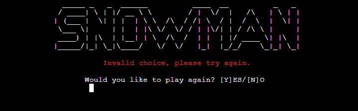
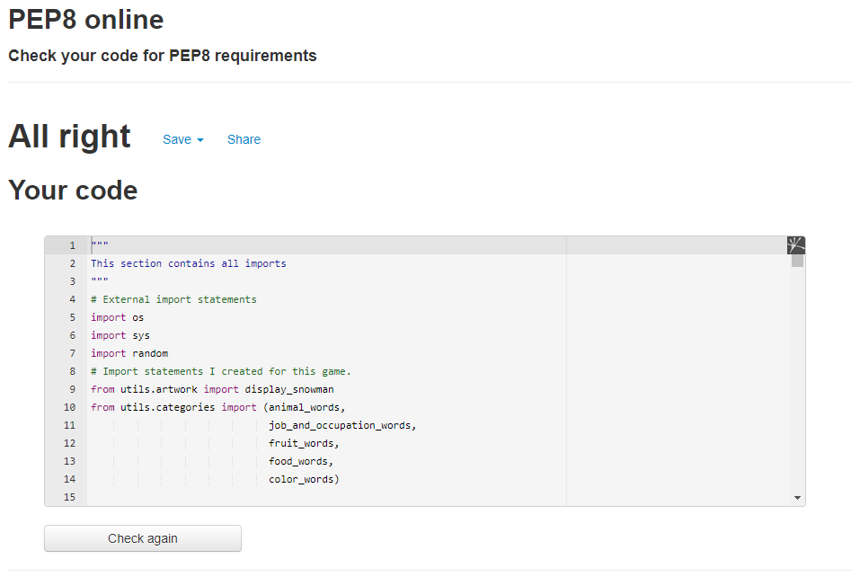

# **Melting Gerry**
The Melting Gerry game is a word game where the goal is to guess the word by selecting different letters until the word is completely guessed.
The main character of this game is a snowman named Gerry.
To save Gerry's life, the user has to find all of the letters in the word randomly selected by the computer from one of the five available categories. Each wrong guess will cause Gerry to start melting. The user has six attempts to guess the word before Gerry gets melted. The game is quite challenging as the length of words to be guessed varies from three to even fifteen letters. In addition, to provide the user with entertainment for a long time, I made sure that the number of available words to guess was appropriate — at the moment there are over 500 of them.

[View the live project here](https://melting-gerry.herokuapp.com/)

---

## **Flow Chart**
The Lucid application was used to create a flow chart for the Melting Gerry game. The flowchart shown below helped me to identify all essential steps within the game and simultaneously offer the bigger picture of the project.

Creating a flowchart helped me find less obvious features of the program's algorithm, which were then refined to improve its performance, i.e., bottlenecks, flaws, and unnecessary steps. 

---

## **User Experience (UX)**

### **User Goals**
* The game is easy to navigate and provides appropriate functionality to entertain the user.
* The game should have different categories of words the user can choose from.
* Each category should contain words of varying difficulty to guess.
* Each category should contain enough words to guess to provide the user with the appropriate level of entertainment.
* The game rules are clearly explained.
* The game should allow the user to continue to play after each game.
* The user should know how many attempts are left to guess the word.
* The user should know which letters have already been used.
* The game should appropriately handle the user entries.

### **User Stories**
* As a user, I want the game instructions to be easily accessible and easy to understand.
* As a user, I want the game to be intuitive and easy to navigate.
* As a user, I want to have the option to choose different word categories.
* As a user, I want to try to guess words of varying difficulty levels.
* As a user, I want to know the word I was trying to guess when the game is over.

### **Site owners Goals**
* To have an easy-to-navigate and entertaining website where users can spend some time enjoying the Melting Gerry game.
* To have different word categories so the user can have an option to try to guess different words.
* To have an algorithm in the code that can handle all the user inputs.
* To have enough words to guess in each category to entertain the user for a long time.

---
## **Design**

### **Colors**
* Coloured Text

    To achieve a better user experience, I decided to implement a simple color scheme to improve the overall user experience.
    * The red color was used to highlight errors due to incorrect user entries.

    
    * The yellow color was used to inform the user that the letter they have chosen to guess the word is not in the word.

    
    * The green color is used to inform the user that the letter they had chosen to guess the word was correct. In addition, this color is used to display a congratulation message if the word is guessed correctly.

    
    
    * The blue color was used to display information when the game is over and the word is not guessed correctly.

    
### **Artwork**
* The main “Snowman” logo was created using the [Text to ASCII ART Generator](https://patorjk.com/software/taag/#p=testall&h=3&f=Big&t=SNOWMAN) with some small     modifications from the originally generated artwork.
    

* The artwork of Gerry the Snowman is a mix of two artworks found on [ASCII Art](https://www.asciiart.eu/holiday-and-events/christmas/snowmen)
    * Art by Hayley Jane Wakenshaw
    * Art by jb

    The final artwork was created by myself using two artworks mentioned above.

    

---

## **Features**

### **User Name**
* Once the program has been executed, the welcome screen is displayed informing the user about the game name.
* The user is asked to enter their name before the game starts.

    
* Only alphabetical characters are allowed when entering the user name. Special characters, numbers, etc., will not be accepted.

    
* In addition, the user name cannot be longer than 20 letters.

    
* If the user name has an incorrect format (blank), an appropriate message will be displayed on the screen.

    

### **Menu**
* Once the player's name is entered, the game menu is displayed on the screen. To achieve a better user experience, I decided to have all the text information displayed in the middle of the console, which in my opinion, looks very nice.

    
* At this stage the user has three options:
    * Play game
    * Read instructions on how to play
    * Exit game

    Short text information is displayed below the menu, informing which key needs to be pressed to select each option.        
    If the user presses other keys than “P”, “I” or "E", then a message will be displayed to correctly enter one of the available options.

    

### **Instructions how to play**
* Once the user selects to read the game instructions, the following screen will be displayed in the console window. The game instructions are very simple and easy to follow.

    
* When the user is familiar with game instructions, they have two options:
    * Play the game by pressing the “P” key.
    * Return to the main menu by pressing the “E” key.
* If the user chooses a different option, a message will be displayed on the screen asking them to select a valid option.

    

### **Play game**
* Before the game starts, the user will be asked to choose a category from which the random word will be selected. The game is challenging; therefore, the difficulty of guessing the word will vary. Some words can only contain three letters to guess, while others can even have fifteen letters (random selection).
* Currently, in the game, there are five-word categories to choose from:
    * Animals
    * Job and occupation
    * Fruit
    * Food
    * Colors

    

* If the user selects a different option than is available, the following message will be displayed in the console.

    
* If the user decides to press the “E” key the main menu will be displayed again in the console.
* If the correct category is selected by the user, the main game screen will be displayed.

    
* During the game the following information is displayed on the screen:
    * The number of attempts left to guess the word,
    * The hidden word is represented by the underscore characters '_' The number of underscore characters equals the number of letters in the word to be guessed.
    * Which letters have been already used to guess the word
* Once the letter is entered by the user, the program checks if the letter is listed in the word. If not, information in yellow color is displayed on the screen to inform the user that the letter they selected is not correct. The used letters table will be updated automatically with the chosen letter. The number of attempts to finish the game will decrease.
* Snowman Gerry will start melting!!!

    
* If the letter entered by the player is correct, information in green color is displayed on the screen to inform the user that the letter they selected is correct. The used letters table will be updated automatically. The number of attempts to finish the game remains the same.

    
* Snowman Gerry is safe!!!
* If the same letter is entered by the user again, the following message is displayed on the screen. The used letters table is not updated as the letter is already being used. The number of attempts to finish the game is not changed either.

    
* If the user enters a character other than the letter, the appropriate information will be displayed in the console.
* The number of attempts left to finish the game remains the same.

    
* If more than one letter is entered by the user, the following error message will be displayed to inform the user to enter only one letter at a time.

    
* When the number of attempts to save Gerry’s life is equal to zero, a new screen will be displayed informing the user that snowman Gerry has melted. At this stage, the user has the option to start the game again by pressing the “Y” key or exit the main menu by pressing the “N” key.

    
* If any other option than “Y” or “N” is selected by the user, the following screen will be displayed to inform the user to choose the correct option.

    
* If the word is guessed correctly, a congratulations message is displayed on the screen. The user has the option to play the game again or exit to the main menu.

    
* If any other option than “Y” or “N” is selected by the user, the following screen will be displayed to inform the user to choose the correct option.

    

###  **Exit game**
* If the user hit the E key while in the main menu, the game will be terminated and the game exit screen will be displayed.

    

---

## **Features to be implemented**
* To have a record of users’ highest scores. 

    I plan to implement this idea by using a Google spreadsheet to store the number of guesses and the number of games won by each player. The user would receive information on which position they are in on the high score list after finishing the game and saving the results in a spreadsheet. There should also be an option in the game menu to display the high score list on the screen with limitations to the top 10 highest scores.

---

## **Deployment**
The project was deployed to Heroku following the steps below:
* Commit changes and push them to GitHub.
* Go to Heroku's website.
* Create an account or select login.
* From the Heroku dashboard, click on "Create new app".
* Enter the "App name" and "Choose a region" before clicking on "Create app".
* Select "Config Vars" under the "Settings" tab.
* Click on "Reveals Config Vars".
* Add in the Config Var, KEY: PORT, and VALUE: 8000.
* Click on the "Buildpacks" section and click "Add buildpack".
* Select "python" and click "Save changes"
* Add "nodejs" buildpack using the same process.

Due to the current security breach in Heroku, the following steps were taken to deploy the game code to Heroku:
* In the Gitpod console application enter “heroku login -i”
* Log in with the email address used while creating the Heroku account.
* Enter the password.
* Enter “heroku git: remote -a melting-gerry” to remotely connect the application with the Gitpod terminal.
* Once the code is ready to be deployed enter “git push heroku main” in the console to deploy to Heroku.

---

## **Technologies Used**

### **Languages**
* [Python](https://www.python.org/)

### **Tools**
* [Github](https://github.com/)
    * Used to store all the project files written in Gitpod.
* [GitPod](https://www.gitpod.io/) 
    * Used for writing the code, committing, and pushing to GitHub. Gitpod terminal was also used to deploy the project to Heroku.
* [PEP8 validator](http://pep8online.com/)
    * Used to validate the python code.
* [VS Code](https://code.visualstudio.com/)
    * To test the code in case of any problems
* [Heroku](https://www.heroku.com)
    * To deploy the project into the live environment.
* [Lucid](https://lucid.app/users/login)
    * To create a project diagram.

---

## **Testing**
### **PEP8**
The code has been tested using [PEP8 Online](http://pep8online.com/)
* Initial Validator Testing

    
* Final Validator Testing

    

### **Manual testing**
* The tests were performed on both the Gitpod terminal and the  Heroku terminal.
* The tests were performed on each screen of the game by entering data out of acceptable range. No issues noted - all the user entries are handled correctly. 
* Relevant message is displayed on the screen if the user entries are incorrect. See relavant screenshots in **Features** section.
* Friends and family members were asked to review the game and provide their feedback about the UX, bugs, etc. No issues were reported. 

## **Testing User Stories from the User Experience (UX) Section**
As a user, I want the game instructions to be easily accessible and easy to understand
* **Plan**
    
    Describe the game rules in a very simple way and ensure the user has easy access to read them.
* **Implementation**

    When the user selects to read the game instructions by pressing the “I” key in the main menu, a new screen in the console will be displayed with the rules of the game.
* **Testing**

    Tests have been conducted numerous times to ensure that the game rules are displayed correctly after pressing the "I" key from the main menu. In addition, many of my friends who were testing this game confirmed that the game rules are explained very well in a clear and very understandable form.
* **Result**

    The game instructions are explained very well and they are easily accessible.
* **Verdict**

    The user has easy access to the game rules which are easily understandable.

As a user, I want the game to be intuitive and easy to navigate.
* **Plan**
    
    Create a very simple game control system that is easy to navigate and very intuitive to use.
* **Implementation**

    *Main menu section*
    
    The following letters are being used to ensure easy navigation in the main menu:
    * P key will start the game,
    * I key will display the game instructions,
    * E key will exit the game.

    *Instructions how to play section*

    The following letters are used to ensure easy navigation in the section where the game instructions are displayed:
    * P key will start the game,
    * E key will return to the main menu

    *Category selection section*
    
    Only numbers from 1 -5 will be accepted when choosing a word category
    * E key will return to the main menu

    *Handling other user entries*
    If the user presses a key other than the required key, a message prompting the user to press the appropriate key will appear on the screen.
	
* **Testing**
    
    Testing was carried out in each section of the game to ensure that only appropriate keys pressed by the user would be accepted to navigate properly through the game. If the user presses a key other than the required one, a message will be displayed on the screen asking the user to press the correct key.

* **Result**

    All tests passed. No issues noted. The game navigation system is working as expected.
* **Verdict**

    A simple navigation system has been implemented successfully.

As a user, I want to have an option to choose different word categories
* **Plan**

    Provide the user with the ability to choose a category from which they will be guessing the word

* **Implementation**

    Five different categories are available for the user to choose from. See the list below:
    * Animals
    * Job and occupation
    * Fruit
    * Food
    * Colors

* **Testing**

    Tests have been conducted numerous times to ensure that the words are loaded correctly from each category selected.

* **Result**

    Tests confirmed that the words are being loaded from each category.

* **Verdict**

    The user can choose from 5 different categories. Each category has a corresponding set of words to avoid the same word being randomized for guesswork.

As a user, I want to try to guess words of varying difficulty levels.
* **Plan**
    
    Each category should contain words of varying length

* **Implementation**
    
    The following websites were visited to build word banks for each category.
    * [enchantedlearning.com](https://www.enchantedlearning.com/wordlist/)
    * [thegamegal.com](https://www.thegamegal.com/printables/)

	The word banks available in the game are as follows:
    * The animal category contains 88 words with word lengths ranging from three to twelve letters. 
    * The job and occupation category contains 204 words with word lengths ranging from three to fifteen letters. 
    * The fruit category contains 53 words with word lengths ranging from three to eleven letters. 
    * The food category contains 58 words with word lengths ranging from three to ten letters. 
    * The colors category contains 105 words with word lengths ranging from three to thirteen letters.  

* **Testing**
    
    Tests were carried out multiple times to ensure that the words displayed on the screen were of varying lengths, meaning that they had varying difficulty levels to guess.

* **Result**

    Each category provides words of varying difficulty levels to guess which are correctly displayed on the screen.

* **Verdict**

    The game provides words to be guessed of varying difficulty levels for each category.

As a user, I want to know the word I was trying to guess when the game is over

* **Plan**

    Display the word the user was trying to guess. 

* **Implementation**
    When the game is over, and the word is not guessed b the user, the word will be revealed and displayed on a new screen.
    When the game is over and the word is guessed by the user, the word will be displayed on a new screen with a congratulations message.

* **Testing**
    
    Tests have been conducted numerous times to ensure that the word is displayed correctly when the game is over.

* **Result**
    
    The user has the opportunity to find out what was the word they were trying to guess during the game

* **Verdict**
    
    The test has passed all the criteria and works as planned.

---

## **Content**
* The artwork used in this project was copied from the following websites:
    * [ASCII ART Generator](https://patorjk.com/software/taag/#p=testall&h=3&f=Big&t=SNOWMAN)
    * [ASCII Art](https://www.asciiart.eu/holiday-and-events/christmas/snowmen)
* The following websites were visited to build word banks for each category:
    * [enchantedlearning.com](https://www.enchantedlearning.com/wordlist/)
    * [www.thegamegal.com](https://www.thegamegal.com/printables/)

---

## **Acknowledgments**
* My Mentor Simen [Eventyret_mentor](https://github.com/Eventyret) for continuous helpful feedback.
* Code Institute's [Slack](https://app.slack.com/client/) community for their support.
* [W3Schools](https://www.w3schools.com/python/) as an additional source of knowledge.
* All family members and friends who helped test this game.

