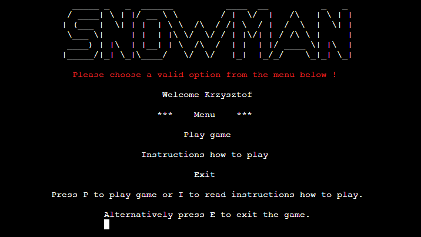
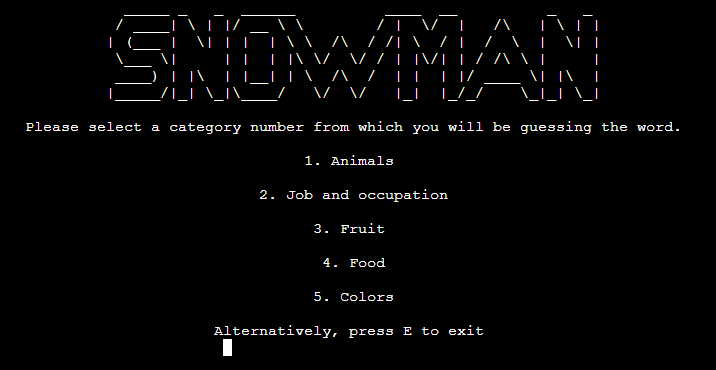

# **Melting Gerry**

## **Flow Chart**
The Lucid application was used to create a flow chart for the Melting Gerry game. The flowchart shown below helped me to identify all essential steps within the game and simultaneously offer the bigger picture of the project.

Creating a flowchart helped me find less obvious features of the program's algorithm, which were then refined to improve its performance, ie bottlenecks, flaws, and unnecessary steps. 

---

## **User Experience (UX)**

### **User Goals**
* The game is easy to navigate and provides appropriate functionality to entertain the user.
* The game should have different categories of words the user can choose from.
* Each category should contain words of varying difficulty to guess.
* Each category should contain enough words to guess to provide the user with the appropriate level of entertainment.
* The game rules are clearly explained.
* The game should allow the user to continue to play after each game.
* The user should know how many attempts are left to guess the word.
* The user should know which letters have already been used.
* The game should appropriately handle the user entries.

### **User Stories**
* As a user, I want the game instructions to be easily accessible and easy to understand.
* As a user, I want the game to be intuitive and easy to navigate.
* As a user, I want the game to be fun and engaging.
* As a user, I want to have the option to choose different word categories.
* As a user, I want to try to guess words of varying difficulty levels.
* As a user, I want to know the word I was trying to guess when the game is over.

### **Site owners Goals**
* To have an easy-to-navigate and entertaining website where users can spend some time enjoying the Melting Gerry game.
* To have different word categories so the user can have an option to try to guess different words.
* To have an algorithm in the code that can handle all the user inputs.
* To have enough words to guess in each category to entertain the user for a long time.

---

## **Design**

### **Colors**
* Coloured Text

    To achieve a better user experience, I decided to implement a simple color scheme to improve the overall user experience.
    * The red color was used to highlight errors due to incorrect user entries.

    
    * The yellow color was used to inform the user that the letter they have chosen to guess the word is not in the word.

    
    * The green color is used to inform the user that the letter they had chosen to guess the word was correct. In addition, this color is used to display a congratulation message if the word is guessed correctly.

    
    
    * The blue color was used to display information when the game is over and the word is not guessed correctly.

    
### **Artwork**
* The main “Snowman” logo was created using the [Text to ASCII ART Generator](https://patorjk.com/software/taag/#p=testall&h=3&f=Big&t=SNOWMAN) with some small     modifications from the originally generated artwork.
    

* The artwork of Gerry the Snowman is a mix of two artworks found on [ASCII Art](https://www.asciiart.eu/holiday-and-events/christmas/snowmen)
    * Art by Hayley Jane Wakenshaw
    * Art by jb

    The final artwork was created by myself using two artworks mentioned above.

    

---

## **Features**

### **User Name**
* Once the program has been executed, the welcome screen is displayed informing the user about the game name.
* The user is asked to enter their name before the game starts.

    
* Only alphabetical characters are allowed when entering the user name. Special characters, numbers, etc., will not be accepted.

    
* In addition, the user name cannot be longer than 20 letters.

    
* If the user name has an incorrect format (blank), an appropriate message will be displayed on the screen.

    

### **Menu**
* Once the player's name is entered, the game menu is displayed on the screen. To achieve a better user experience, I decided to have all the text information displayed in the middle of the console, which in my opinion, looks very nice.

    
* At this stage the user has three options:
    * Play game
    * Read instructions on how to play
    * Exit game

    Short text information is displayed below the menu, informing which key needs to be pressed to select each option.        
    If the user presses other keys than “P”, “I” or "E", then a message will be displayed to correctly enter one of the available options.

    

### **Instructions how to play**
* Once the user selects to read the game instructions, the following screen will be displayed in the console window. The game instructions are very simple and easy to follow.

    
* When the user is familiar with game instructions, they have two options:
    * Play the game by pressing the “P” key.
    * Return to the main menu by pressing the “E” key.
* If the user chooses a different option, a message will be displayed on the screen asking them to select a valid option.

    

### **Play game**
* Before the game starts, the user will be asked to choose a category from which the random word will be selected. The game is challenging; therefore, the difficulty of guessing the word will vary. Some words can only contain three letters to guess, while others can even have fifteen letters (random selection).
* Currently, in the game, there are five-word categories to choose from:
    * Animals
    * Job and occupation
    * Fruit
    * Food
    * Colors

    

* If the user selects a different option than is available, the following message will be displayed in the console.

    
* If the user decides to press the “E” key the main menu will be displayed again in the console.
* If the correct category is selected by the user, the main game screen will be displayed.

    
* During the game the following information is displayed on the screen:
    * The number of attempts left to guess the word,
    * The hidden word is represented by the underscore characters '_' The number of underscore characters equals the number of letters in the word to be guessed.
    * Which letters have been already used to guess the word
* Once the letter is entered by the user, the program checks if the letter is listed in the word. If not, information in yellow color is displayed on the screen to inform the user that the letter they selected is not correct. The used letters table will be updated automatically with the chosen letter. The number of attempts to finish the game will decrease.

