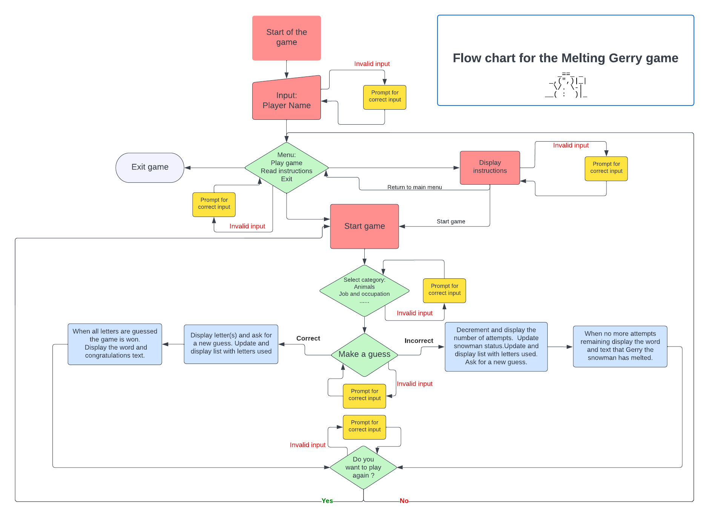

# **Melting Gerry**

## **Flow Chart**
The Lucid application was used to create a flow chart for the Melting Gerry game. The flowchart shown below helped me to identify all essential steps within the game and simultaneously offer the bigger picture of the project.

Creating a flowchart helped me find less obvious features of the program's algorithm, which were then refined to improve its performance, ie bottlenecks, flaws, and unnecessary steps. 

